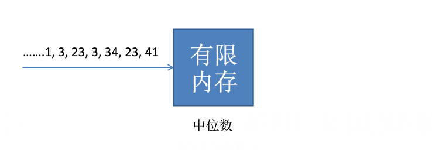

# 亚线性算法

## 亚线性算法的含义

* 时间/空间/IO/通讯/能量等代价是 `o(输入规模)`
* 亚线性时间算法
  * 亚线性时间近似算法
  * 性质检测算法
* 亚线性空间算法
  * 数据流算法

***

## 亚线性 时间问题

* 给定一个社交网络，如何平均每个人的朋友个数，即在上图中计算其节点的平均度
* 能否在不妨问所有顶点的情况下完成此任务？
  * 精确计算需要访问最少 n-1 个顶点
  * 能否可以简单的抽样？

***

## 亚线性空间问题

* 一个（源源不断到来的）数据集合(流)，只能扫面一次，如何求其中位数？
  * 不能存储所有数据 --> 不能对其进行排序
  * 应当存储哪些数据？

***

## 参考资料

* 哈工大大数据算法